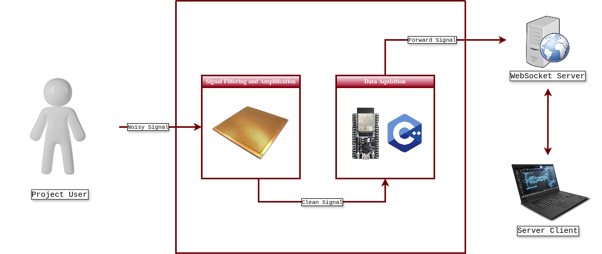
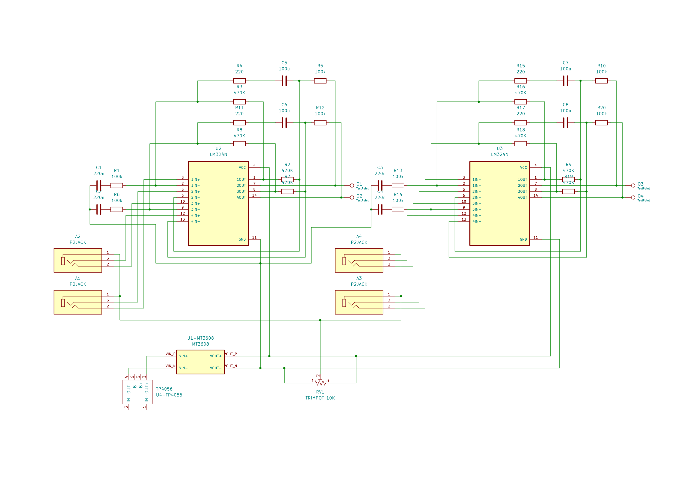
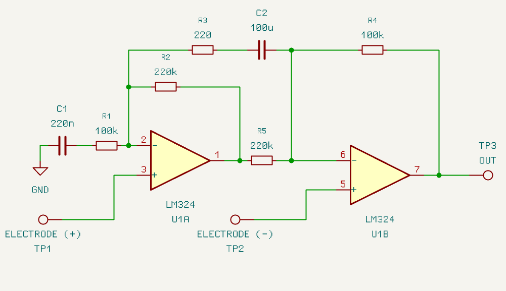
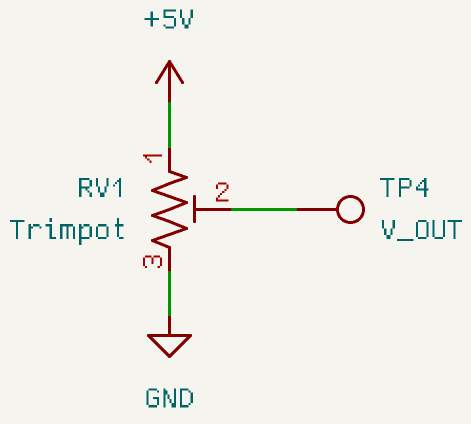
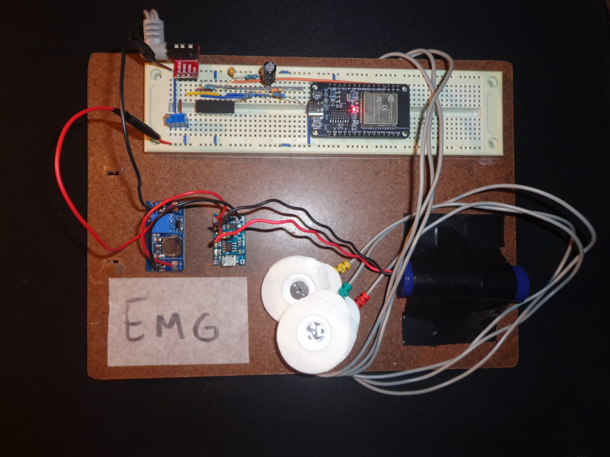

    

<h4 align="center">Electromyograph integrated with an ESP32 Web Server (⚠️ Under Construction!!)</h4>

  <a href="#materials">Materials</a> •
  <a href="#diagrams">Diagrams</a> •
  <a href="software/README.md">Software</a> •
  <a href="LICENSE">License</a>

---

## Basic Overview

This project consists of an implementation of a circuit to measure specific muscle activity. The project emerges as a way to detect muscular issues and restraints in a low-cost and reliable manner. The general architecture of this project is a connection between the electromyograph PCB and the ESP32 microcontroller, where the ESP32 acts as a web server with an WebSocket to handle the data plotting.

## Description

This section explains the details of the project, including the materials and tools used, communication and electrical diagrams and examples of its functionality.

###  Materials

<table>
  <tr>
    <td align="center" valign="top" width="150" style="border: none;">
       
      <strong>Resistor</strong> 
      2x 220Ω • THT
    </td>
    <td align="center" valign="top" width="150" style="border: none;">
       
      <strong>Resistor</strong> 
      4x 100KΩ • THT
    </td>
    <td align="center" valign="top" width="150" style="border: none;">
       
      <strong>Resistor</strong> 
      4x 220KΩ • THT
    </td>
    <td align="center" valign="top" width="150" style="border: none;">
       
      <strong>Trimpot</strong> 
      1x 10KΩ • THT
    </td>
  </tr>
  <tr>
    <td align="center" valign="top" width="150" style="border: none;">
       
      <strong>Capacitor</strong> 
      2x 100μF • Electrolytic • THT
    </td>
    <td align="center" valign="top" width="150" style="border: none;">
       
      <strong>Capacitor</strong> 
      2x 220nF • Ceramic • THT
    </td>
    <td align="center" valign="top" width="150" style="border: none;">
       
      <strong>Battery</strong> 
      1x Lithium-Ion • 3.7V • 18650 • With Wires
    </td>
    <td align="center" valign="top" width="150" style="border: none;">
       
      <strong>MT3608</strong> 
      1x Module
    </td>
  </tr>
  <tr>
    <td align="center" valign="top" width="150" style="border: none;">
       
      <strong>TP4056</strong> 
      1x Module
    </td>
    <td align="center" valign="top" width="150" style="border: none;">
       
      <strong>LM324N</strong> 
      1x Integrated Circuit
    </td>
    <td align="center" valign="top" width="150" style="border: none;">
       
      <strong>TRRS Breakout</strong> 
      1x Module
    </td>
    <td align="center" valign="top" width="150" style="border: none;">
       
      <strong>ESP32</strong> 
      1x ESP-WROOM-32
    </td>
  </tr>
  <tr>
    <td align="center" valign="top" width="150" style="border: none;">
       
      <strong>IC Socket</strong> 
      1x DIP-14
    </td>
    <td align="center" valign="top" width="150" style="border: none;">
       
      <strong>Cell Holder</strong> 
      1x Lithium-Ion • 18650 • Single
    </td>
    <td align="center" valign="top" width="150" style="border: none;">
       
      <strong>Battery</strong> 
      1x Lithium-Ion • 3.7V • 18650
    </td>
    <td align="center" valign="top" width="150" style="border: none;">
       
      <strong>Solder Flux</strong> 
      1x Lead-Free
    </td>
  </tr>
</table>

###  Communication Diagram

In this subsection we will discuss the communication diagram of the project to give a general view of the signal path and a clearer understanding of the circuit itself.

    

The image above represents the communication diagram, which shows the signal path throughout the whole project. The user's noisy low-voltage signal is sent to the printed circuit board (PCB) through silver $Ag$ or silver chloride $AgCl$ electrodes, where it can be properly filtered and amplified. Then the clean signal is carried to the ESP32 microcontroller that acts as a WebSocket Server to handle mass data plotting, hosting an HTML page that displays the graph.

---

### Electrical Diagram

In this subsection we will discuss the communication diagram of the project to give a general view of the signal processing and a clearer understanding of the circuit itself.

    

The image above represents the electrical diagram, which shows the electrical connection between the components. As shown in the image, the circuit consists of:

| Component | Role in the circuit |
| :--- | :--- |
| **Resistors** | Set the gain stages, establish amplifier feedback loops, and stabilize signal lines. |
| **Trimpot** | Adjusts the virtual ground offset (reference voltage) to bias the EMG signal for the ESP32 ADC. |
| **Capacitors** | Filter out DC offsets (high-pass) and high-frequency noise (low-pass), and decouple power rails. |
| **Battery** | Provides clean, isolated 3.7V power to eliminate grid noise ($60\text{ Hz}$) and ensure user safety. |
| **MT3608** | Boosts the 3.7V battery to a stable 5V, ensuring full dynamic range for the op-amps. |
| **TP4056** | Handles safe Li-Ion battery charging and provides over-discharge protection. |
| **LM324N** | Handles differential amplification and active filtering of the microvolt-level muscle signals. |
| **TRRS Breakout** | Serves as the input jack for the 3-lead electrode cable (Signal +, Signal -, and Reference). |
| **ESP32** | Samples the analog processed signal and hosts the WebSocket server for real-time live plotting. |

    

To secure the right voltage for the ESP32 ADC pins, a set of calculations were made, using the following equations:

- **Op-Amps:** By applying Kirchhoff's Laws, it is possible to obtain the expressions for Common and Differential Mode Gain:

| Name | Equation |
| :--- | :--- |
| **Common Mode Voltage** | $V_{cm} = \frac{V_{electrode(+)} + V_{electrode(-)}}{2}$ |
| **Common Mode Gain** | $A_{cm} = 1 - \frac{R_4}{Z_1}$ |
| **Differential Mode Voltage** | $V_{dif} = V_{electrode(+)} - V_{electrode(-)}$ |
| **Differential Mode Gain** | $A_{dif} = -\left(\frac{1}{2} + \frac{R_4}{R_5} + \frac{2R_4}{Z_3} + \frac{R_4}{2Z_1}\right)$ |

Where the complex impedances $Z_1$ and $Z_3$ are defined in the frequency domain ($s$-domain) as:

| Name | Equation |
| :--- | :--- |
| **Impedance $Z_1$** | $Z_1(s) = R_1 + \frac{1}{sC_1}$ |
| **Impedance $Z_3$** | $Z_3(s) = R_3 + \frac{1}{sC_2}$ |

By substituting the values, it follows that the circuit raises the muscle voltage by around $1000$ times.

    

- **Voltage Divider:** To reach a desired reference voltage, the following equation can be used:

| Name | Equation |
| :--- | :--- |
| **Reference Voltage** | $V_{out} = \left(5V\right)\left(\frac{R_{variable}}{R_{total}}\right)$ |

---

## Prototype

A single-channel prototype was implemented on a breadboard to validate the circuit's functionality during the testing phase.

    

---

## Software Used

To install the software, click on the name and you will be redirected to the download page. 

<table>
  <tr>
    <td align="center" valign="top" width="120" style="border: none;">
       
      <strong><a href="https://www.arduino.cc/en/software/">Arduino IDE</a></strong> 
      v2.3.8
    </td>
        <td align="center" valign="top" width="120" style="border: none;">
       
      <strong><a href="https://www.kicad.org/download/">KiCad</a></strong> 
      v10.0.2
    </td>
  </tr>
</table>