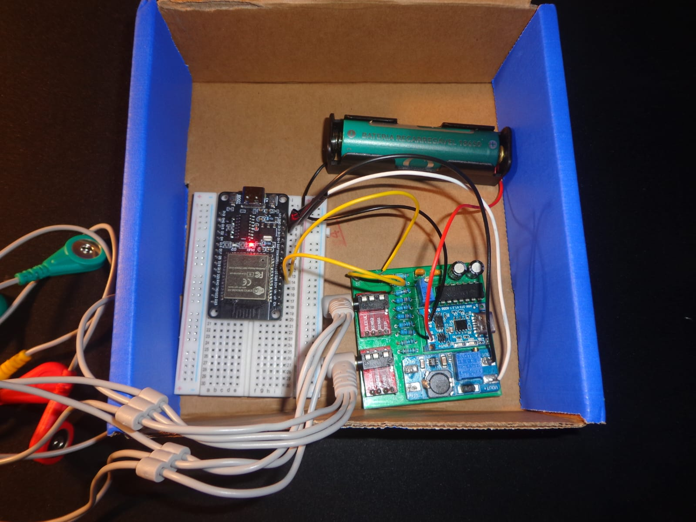
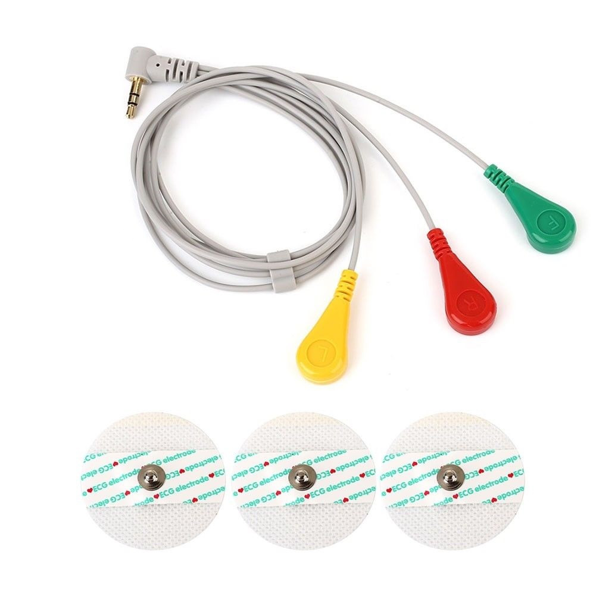

<div align="center">
    
    

<h4 align="center">Electromyograph integrated with an ESP32 Web Server</h4>


</div>

<p align="center">
  <a href="#materials">Materials</a> •
  <a href="#diagrams">Diagrams</a> •
  <a href="software/README.md">Software</a> •
  <a href="LICENSE">License</a>
</p>

---

## Basic Overview

This project consists of an implementation of a circuit to measure specific muscle activity, consisting of two channels, which means that it is possible to measure two muscles simultaneously. The project emerges as a way to detect muscular issues and restraints in a low-cost and reliable manner. The general architecture of this project is a connection between the electromyograph PCB and the ESP32 microcontroller, where the ESP32 acts as a web server with an WebSocket to handle the data plotting. The GIF shown above was made from a video of the electromyograph in operation, which recorded the web page hosted by the ESP32.

## Goals

| Type | Goal |
| :--- | :--- |
| **Hardware** | Design a circuit that is capable of effectively measuring muscle voltage |
| **Hardware** | Make the circuit as noise-free as possible |
| **Software** | Write an optimized code that can display, in real time, the muscle data |

### Project Directory Structure

```text
├── hardware/             # PCB design files (symbols, footprints, models, and Gerbers)
│   ├── footprints/       # Custom component footprints (.kicad_mod)
│   ├── kicad_files/      # KiCad project files and manufacturing Gerbers
│   ├── models/           # 3D step files for components
│   └── symbols/          # Custom schematic symbol libraries (.kicad_sym)
├── images/               # Visual assets for documentation and tutorials
└── software/             # Firmware and source code for the project
    └── plot/             # Arduino source code for data acquisition
```

## Description

This section explains the details of the project, including the materials and tools used, communication and electrical diagrams and examples of its functionality.

### <a id="materials"></a> Materials

<table>
  <tr>
    <td align="center" valign="top" width="150" style="border: none;">
      <br>
      <strong>Resistor</strong><br>
      <font color="#666" size="2">2x 220Ω • 1/4 W • 5% • THT</font>
    </td>
    <td align="center" valign="top" width="150" style="border: none;">
      <br>
      <strong>Resistor</strong><br>
      <font color="#666" size="2">4x 100KΩ • 1/4 W • 5% • THT</font>
    </td>
    <td align="center" valign="top" width="150" style="border: none;">
      <br>
      <strong>Resistor</strong><br>
      <font color="#666" size="2">4x 220KΩ • 1/4 W • 5% • THT</font>
    </td>
    <td align="center" valign="top" width="150" style="border: none;">
      <br>
      <strong>Trimpot</strong><br>
      <font color="#666" size="2">1x 10KΩ • THT</font>
    </td>
  </tr>
  <tr>
    <td align="center" valign="top" width="150" style="border: none;">
      <br>
      <strong>Capacitor</strong><br>
      <font color="#666" size="2">2x 100μF • Electrolytic • THT</font>
    </td>
    <td align="center" valign="top" width="150" style="border: none;">
      <br>
      <strong>Capacitor</strong><br>
      <font color="#666" size="2">2x 220nF • Ceramic • THT</font>
    </td>
    <td align="center" valign="top" width="150" style="border: none;">
      <br>
      <strong>Battery</strong><br>
      <font color="#666" size="2">2x Lithium-Ion • 3.7V • 18650</font>
    </td>
    <td align="center" valign="top" width="150" style="border: none;">
      <br>
      <strong>MT3608</strong><br>
      <font color="#666" size="2">1x Module</font>
    </td>
  </tr>
  <tr>
    <td align="center" valign="top" width="150" style="border: none;">
      <br>
      <strong>TP4056</strong><br>
      <font color="#666" size="2">1x Module</font>
    </td>
    <td align="center" valign="top" width="150" style="border: none;">
      <br>
      <strong>LM324N</strong><br>
      <font color="#666" size="2">1x Integrated Circuit</font>
    </td>
    <td align="center" valign="top" width="150" style="border: none;">
      <br>
      <strong>TRRS Breakout</strong><br>
      <font color="#666" size="2">1x Module</font>
    </td>
    <td align="center" valign="top" width="150" style="border: none;">
      <br>
      <strong>ESP32</strong><br>
      <font color="#666" size="2">1x ESP-WROOM-32</font>
    </td>
  </tr>
  <tr>
    <td align="center" valign="top" width="150" style="border: none;">
      <br>
      <strong>Isopropanol</strong><br>
      <font color="#666" size="2">1x 99.8% Pure</font>
    </td>
    <td align="center" valign="top" width="150" style="border: none;">
      <br>
      <strong>Cell Holder</strong><br>
      <font color="#666" size="2">1x Lithium-Ion • 18650 • Single</font>
    </td>
    <td align="center" valign="top" width="150" style="border: none;">
      <br>
      <strong>EMG Cable</strong><br>
      <font color="#666" size="2">2x P2 Connection</font>
    </td>
    <td align="center" valign="top" width="150" style="border: none;">
      <br>
      <strong>Electrodes</strong><br>
      <font color="#666" size="2">6x Disposable</font>
    </td>
  </tr>
</table>

### <a id="diagrams"></a> Communication Diagram

In this subsection we will discuss the communication diagram of the project to give a general view of the signal path and a clearer understanding of the circuit itself.

<p align="center">
    
</p>

The image above represents the communication diagram, which shows the signal path throughout the whole project. The user's noisy low-voltage signal is sent to the printed circuit board (PCB) through silver $Ag$ or silver chloride $AgCl$ electrodes, where it can be properly filtered and amplified. Then the clean signal is carried to the ESP32 microcontroller that acts as a WebSocket Server to handle massive data plotting, hosting an HTML page that displays the graph.

---

### <a id="electrical"></a> Electrical Diagram


In this subsection we will discuss the communication diagram of the project to give a general view of the signal processing and a clearer understanding of the circuit itself.

<p align="center">
    
</p>

The image above represents the electrical diagram, which shows the electrical connection between the components. As shown in the image, the circuit consists of:

| Component | Role in the circuit |
| :--- | :--- |
| **Resistors** | Set the gain stages, establish amplifier feedback loops, and stabilize signal lines. |
| **Trimpot** | Adjusts the virtual ground offset (reference voltage) to bias the EMG signal for the ESP32 ADC. |
| **Capacitors** | Filter out DC offsets (high-pass) and high-frequency noise (low-pass), and decouple power rails. |
| **Battery** | Provides clean, isolated 3.7V power to eliminate grid noise ($60\text{ Hz}$) and ensure user safety. |
| **MT3608** | Boosts the 3.7V battery to a stable 5V, ensuring full dynamic range for the op-amps. |
| **TP4056** | Handles safe Li-Ion battery charging and provides over-discharge protection. |
| **LM324N** | Handles differential amplification and active filtering of the microvolt-level muscle signals. |
| **TRRS Breakout** | Serves as the input jack for the 3-lead electrode cable (Signal +, Signal -, and Reference). |
| **ESP32 (Implicit)** | Samples the analog processed signal and hosts the WebSocket server for real-time live plotting. |

<p align="center">
    
</p>

To secure the right voltage for the ESP32 ADC pins, a set of calculations were made, using the following equations:

- **Op-Amps:** By applying Kirchhoff's Laws, it is possible to obtain the expressions for Common and Differential Mode Gain:

| Name | Equation |
| :--- | :--- |
| **Common Mode Voltage** | $V_{cm} = \frac{V_{electrode(+)} + V_{electrode(-)}}{2}$ |
| **Common Mode Gain** | $A_{cm} = 1 - \frac{R_4}{Z_1}$ |
| **Differential Mode Voltage** | $V_{dif} = V_{electrode(+)} - V_{electrode(-)}$ |
| **Differential Mode Gain** | $A_{dif} = -\left(\frac{1}{2} + \frac{R_4}{R_5} + \frac{2R_4}{Z_3} + \frac{R_4}{2Z_1}\right)$ |

Where the complex impedances $Z_1$ and $Z_3$ are defined in the frequency domain ($s$-domain) as:

| Name | Equation |
| :--- | :--- |
| **Impedance $Z_1$** | $Z_1(s) = R_1 + \frac{1}{sC_1}$ |
| **Impedance $Z_3$** | $Z_3(s) = R_3 + \frac{1}{sC_2}$ |

By substituting the values, it follows that the circuit raises the muscle voltage by around $1000$ times.

<p align="center">
    
</p>

- **Voltage Divider:** To reach a desired reference voltage, the following equation can be used:

| Name | Equation |
| :--- | :--- |
| **Reference Voltage** | $V_{out} = \left(5V\right)\left(\frac{R_{variable}}{R_{total}}\right)$ |

---

### Pin Reference

<p align="center">
    
</p>

For reference look at the <a href="#electrical">Electrical Diagram</a>.

| Pin Number | Connected to |
| :--- | :--- |
| **Pin 1** | VOUT_P (MT3608) |
| **Pin 2** | VOUT_N (MT3608) |
| **Pin 11** | O1 (Output 1) |
| **Pin 12** | O2 (Output 2) |

All the others are **disconnected**.

> [!IMPORTANT]  
> Even though the project has only one graph, both of the outputs needs to be connected. The first output (O1) is the main channel, and the second output (O2) is an auxiliar channel that helps in cleaning the noise.

---

## Prototype

A single-channel prototype was implemented on a breadboard to validate the circuit's functionality during the testing phase. The prototype can be seen in the image below.

<p align="center">
    
</p>

---

## Final Assembly

In the image below, it is shown the final assembly of this project, consisting of two main blocks, the printed circuit board (PCB), which was ordered from <a href="https://jlcpcb.com/">JLCPCB</a>, and the ESP32 microcontroller.


<p align="center">
    
</p>

> [!TIP]
> In environments highly susceptible to noise, such as an electromyograph, it is important to clean the board with isopropanol and an anti-static brush to remove any soldering residue.

To help reduce the noise, it was used copper pouring in both layers of the printed circuit board (PCB). In the table below it is presented some important parameters of the board.

| Parameter | Value |
| :--- | :--- |
| **Power Trace Width** | $0.4 \ mm$ |
| **Signal Trace Width** | $0.2 \ mm$ |
| **Clearance** | $0.2 \ mm$ |
| **Via Size** | $0.6 \ mm$ |
| **Via Hole** | $0.3 \ mm$ |
| **μVia Size** | $0.3 \ mm$ |
| **μVia Hole** | $0.1 \ mm$ |
| **DP Width** | $0.2 \ mm$ |
| **DP Gap** | $0.25 \ mm$ |

---

## Electrode Placement

<p align="center">
    
</p>

| Cable End | Role |
| :--- | :--- |
| **Yellow** | Reference |
| **Green** | Negative |
| **Red** | Positive |

> [!IMPORTANT]  
> Place the yellow electrode in a non-muscular part of the body, and the centers of green and red electrodes within 2 centimeters apart along the desired muscle fibers.

---

## Software Used

To install the software, click on the name and you will be redirected to the download page. 

<table>
  <tr>
    <td align="center" valign="top" width="120" style="border: none;">
      <br>
      <strong><a href="https://www.arduino.cc/en/software/">Arduino IDE</a></strong><br>
      <font color="#666" size="2">v2.3.8</font>
    </td>
        <td align="center" valign="top" width="120" style="border: none;">
      <br>
      <strong><a href="https://www.kicad.org/download/">KiCad</a></strong><br>
      <font color="#666" size="2">v10.0.2</font>
    </td>
     </td>
        <td align="center" valign="top" width="120" style="border: none;">
      <br>
      <strong><a href="https://krita.org/pt-br/download/">Krita</a></strong><br>
      <font color="#666" size="2">v6.0.2.1</font>
    </td>
  </tr>
</table>

## References

[1] Rodrigues, I. T., Bonfim, M. J., Miyazaki, D. R., da Fonseca, M. S. R. S., & da Silva Ferraz, R. Dispositivo de Aquisição de Sinais Eletromiograficos de Superfície para Monitoramento em Tempo Real.