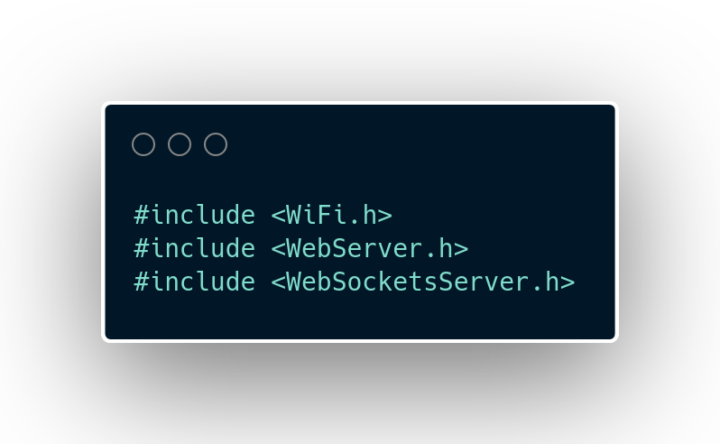
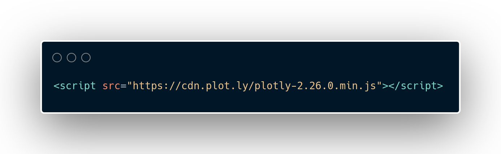
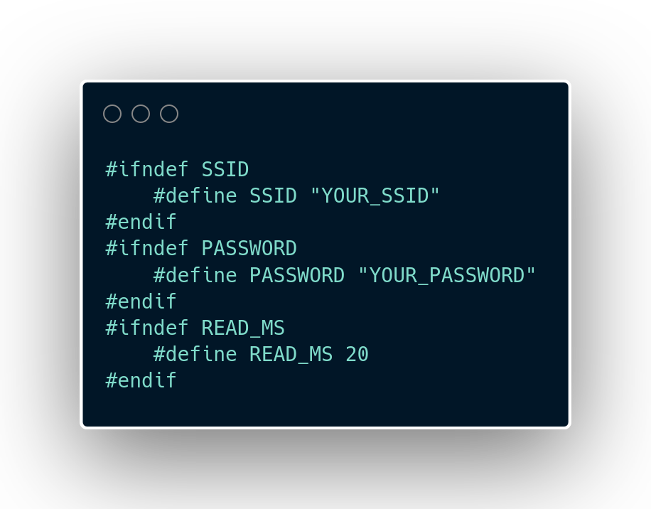
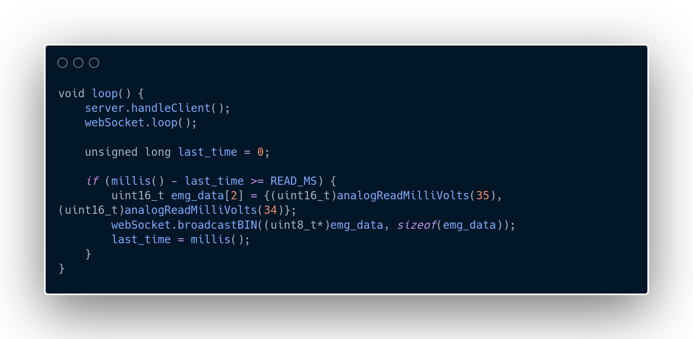
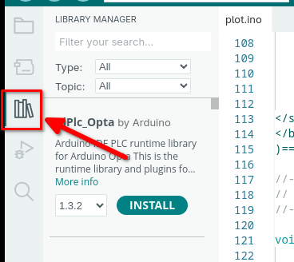
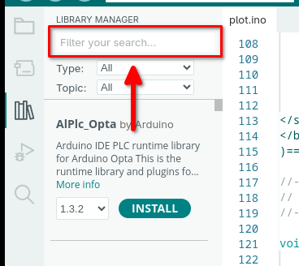
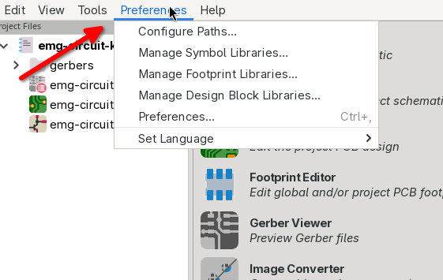
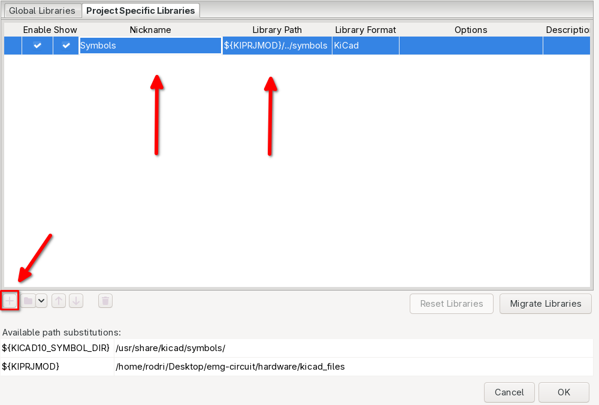
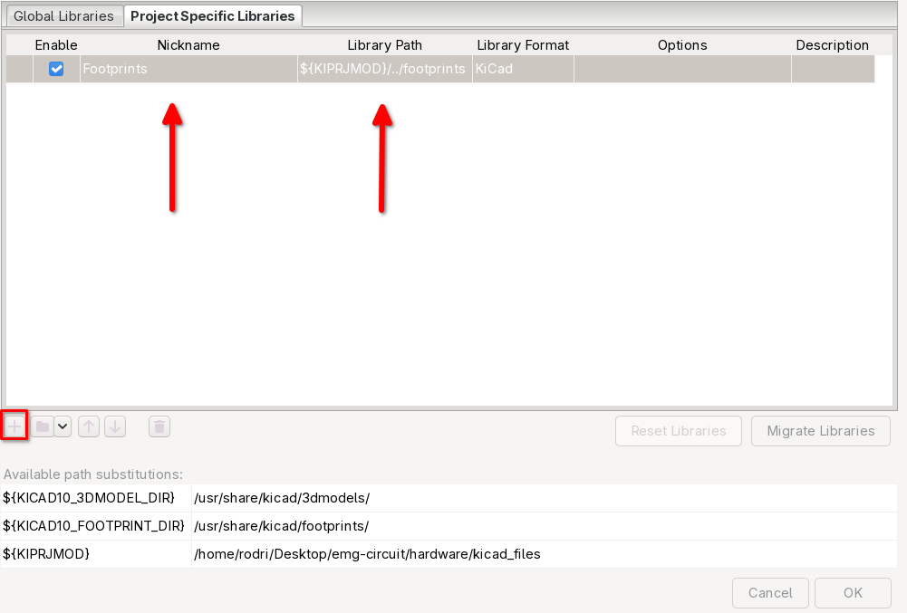

## Code Explanation

In this file, the main aspects of the software-side of the project are covered, such as libraries used, the network setup, a brief explanation of the logic and how the data was plotted. It was added a tutorial on how to install the specific libraries and softwares at the end of this document. 

---

### Libraries

<p align="center">
    
    
</p>

In the image above, it is presented the part of the code where the libraries used in the project were declared. The libraries installed are the following

| Library | Version |
| :--- | :--- |
| **Async TCP** | 3.4.10 |
| **ESP Async WebServer** | 3.11.1 |
| **WebSockets** | 2.7.2 |
| **Plotly** | 2.26.0 |

The **Async TCP**, **ESP Async WebServer** and the **WebSockets** library are used for the Web Server, **Plotly** in the other hand is used to handle the mass data plottling and displaying it nicely in a graph.

---

### Defines

<p align="center">
    
</p>

In the image above, it is shown the declaration of two constants (SSID and PASSWORD) that serve to setup the Web Server. If you wish to use this code, you will need to change **YOUR_SSID**, with your network SSID, and **YOUR_PASSWORD** with your network password in order to make the ESP32 work as a server. The third constant that can be seen in the image is **READ_MS**, which is a way to parametrize the delay between the readings of the electromyograph.

---

### Main Loop

<p align="center">
    
</p>

In the image above, it is shown the main loop. The thing here, is that we calculate the difference between the function **millis()** the variable **last_time** to get the time between the two last readings, but, the microcontroller can stutter if too many readings are made in a short period of time. To solve that, it is needed to use a threshold, in this case the constant **READ_MS**, only readings within time spans greater or equal than **READ_MS** are accepted. If you look inside of the if statement, there is a declaration of an array that will hold the raw readings from the ESP32 analog to digital pins, and in the next line it is called a function to broadcast these in binary form, to optimize the microcontroller and prevent lagging.

---

### How to install the libraries

#### Arduino IDE

First open **Arduino IDE**, then you will see a bar on the left with an libraries button, represented with books, as shown in the image below.

<p align="center">
    
</p>

Type the desired library (**Async TCP**, **ESP Async WebServer** and **WebSockets**) in the search field and then click **INSTALL**.

<p align="center">
    
</p>

Notice that **Plotly** does not need to be installed, as it is imported from **CDN (Content Delivery Network)**.

#### KiCad

First open **KiCad**, then you will see in the top bar a section named **Preferences**, as shown in the image below.

<p align="center">
    
</p>

Then, click on **Manage Symbol Libraries**, and go to the **Project Specific Libraries** tab. Make sure that it looks something like the image below, if not, click on the plus sign and fill the fields as it is being presented.

<p align="center">
    
</p>

```
Symbols
```

```
${KIPRJMOD}/../symbols
```

Do the same verification for **Manage Footprint Libraries**, in the **Project Specific Libraries** tab.

<p align="center">
    
</p>

```
Footprints
```

```
${KIPRJMOD}/../footprints
```
