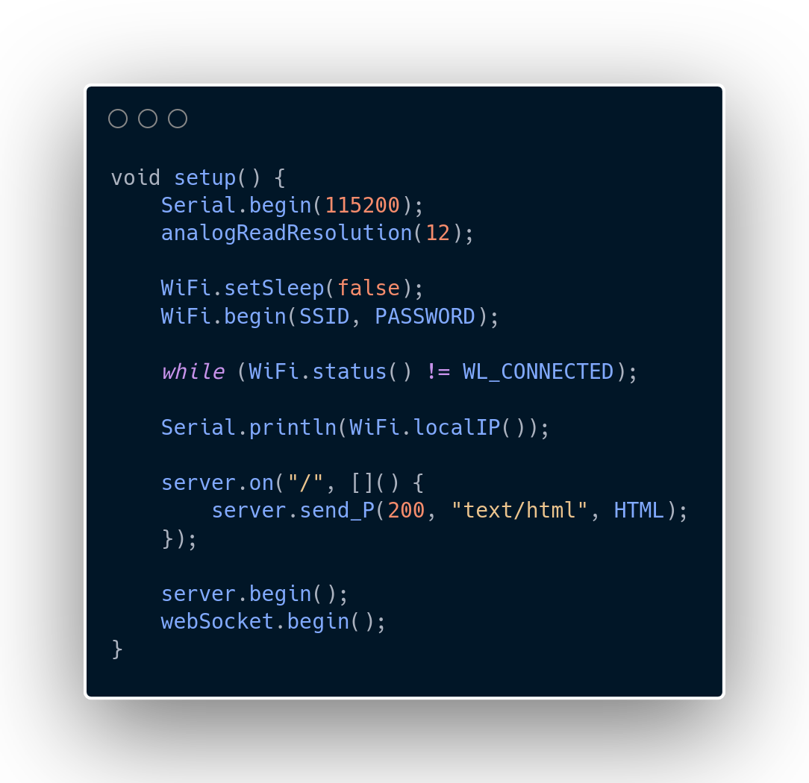
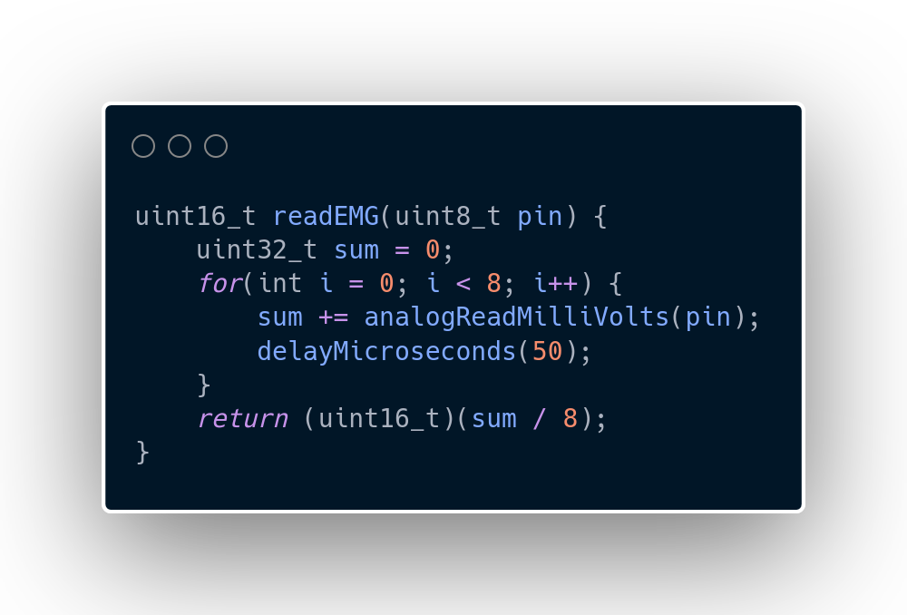

<p align="center">
    
</p>

## Basic Overview

In this file, the main aspects of the software side of the project are covered, such as libraries used, the network setup, a brief explanation of the logic and how the data was plotted. It was added a tutorial on how to install the specific libraries and softwares at the end of this document. 

---

### Libraries

<p align="center">
    
    
</p>

In the images above, it is presented the part of the code where the libraries used in the project were declared. The libraries installed are the following

| Library | Version |
| :--- | :--- |
| **Async TCP** | v3.4.10 |
| **ESP Async WebServer** | v3.11.1 |
| **WebSockets** | v2.7.2 |
| **Plotly** | v2.26.0 |

The **Async TCP**, **ESP Async WebServer** and the **WebSockets** library are used for the Web Server, **Plotly** in the other hand is used to handle the massive data plotting and displaying it nicely in a voltage against time graph.

### Setup

This **setup** function initializes the environment for an ESP32 or similar microcontroller to function as a web server.

<p align="center">
    
</p>

 It begins by configuring serial communication at **115200 baud** for debugging and setting the analog-to-digital converter to 12-bit resolution for precise readings. To ensure stable connectivity, the code disables WiFi sleep mode before initiating a connection to the specified network, blocking further execution until a valid IP address is assigned and printed to the serial monitor. Finally, it defines the web server's root route to serve static HTML content and formally starts the **WebSocket** server to enable real-time, bidirectional data communication with connected clients.

### Plotly Example

To efficiently handle continuous data streams from an ESP32, this implementation utilizes the **Plotly.js** library. The visualization process is effectively divided into two distinct phases: the initial setup of the graph container and the high-performance handling of incoming WebSocket data packets.

<p align="center">
    
</p>

The initialization phase is managed by the **Plotly.newPlot** function. This step defines the target **DOM** element for the chart and establishes the visual configuration, such as margin spacing and line styling. By setting the yaxis.range to [0, 3.3], the graph is correctly constrained to match the operating voltage of the **ESP32’s analog-to-digital converter** (ADC), ensuring that all incoming readings fit appropriately within the display area. Features like grid lines and the mode bar are also disabled here to minimize rendering overhead and maintain a cleaner user interface.

For real-time streaming, the **extendTraces** function is used instead of redrawing the entire graph, which is essential for performance. When the WebSocket receives a message, the data—sent as an ArrayBuffer—is parsed using a DataView. The raw 16-bit unsigned integer is converted into a meaningful voltage reading by dividing by 1000.0. This updated value is then passed to **extendTraces**, which efficiently appends the data point to the graph. By limiting the points variable to 300, the plot automatically maintains a smooth, sliding window effect that visualizes the signal in real-time without overwhelming the browser's resources.

---

### Filtering

<p align="center">
    
</p>

In the image above, it is shown a function that calculates the mean of the last eight readings from the pin specified in the parameter, helping in stabilizing the signal.

---

### Defines

<p align="center">
    
</p>

In the image above, it is shown the declaration of two constants (SSID and PASSWORD) that serve to setup the Web Server. If you wish to use this code, you will need to change **YOUR_SSID**, with your network SSID, and **YOUR_PASSWORD** with your network password in order to make the ESP32 work as a server. The third constant that can be seen in the image is **READ_MS**, which is a way to parametrize the delay between the readings of the electromyograph.

---

### Main Loop

<p align="center">
    
</p>

In the image above, it is shown the main loop. The thing here, is that we calculate the difference between the function **millis()** the variable **last_time** to get the time between the two last readings, but, the microcontroller can stutter if too many readings are made in a short period of time. To solve that, it is needed to use a threshold, in this case the constant **READ_MS**, only readings within time spans greater or equal than **READ_MS** are accepted. If you look inside of the if statement, there is a declaration of an variable that will hold the raw reading from the ESP32 analog to digital pin, and in the next line it is called a function to broadcast these in binary form, to optimize the microcontroller and prevent lagging.

---

### How to install the libraries

#### Arduino IDE

First open **Arduino IDE**, then you will see a bar on the left with an libraries button, represented with books, as shown in the image below.

<p align="center">
    
</p>

Type the desired library (**Async TCP**, **ESP Async WebServer** and **WebSockets**) in the search field and then click **INSTALL**.

<p align="center">
    
</p>

Notice that **Plotly** does not need to be installed, as it is imported from **CDN (Content Delivery Network)**.

#### KiCad

First open **KiCad**, then you will see in the top bar a section named **Preferences**, as shown in the image below.

<p align="center">
    
</p>

Then, click on **Manage Symbol Libraries**, and go to the **Project Specific Libraries** tab. Make sure that it looks something like the image below, if not, click on the plus sign and fill the fields as it is being presented.

<p align="center">
    
</p>

```
Symbols
```

```
${KIPRJMOD}/../symbols
```

Do the same verification for **Manage Footprint Libraries**, in the **Project Specific Libraries** tab.

<p align="center">
    
</p>

```
Footprints
```

```
${KIPRJMOD}/../footprints
```
